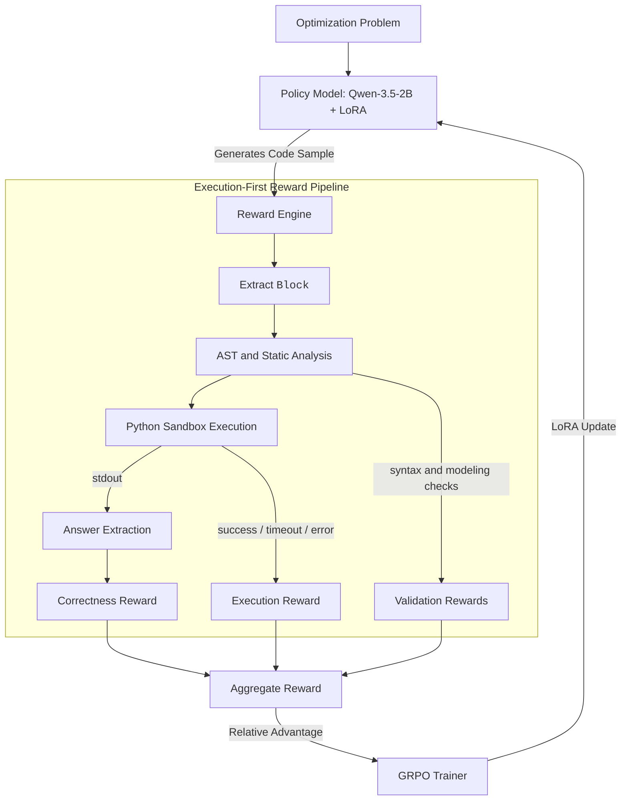
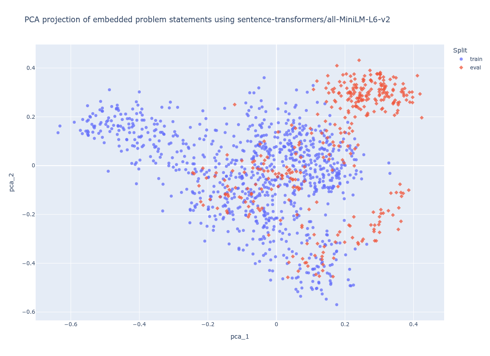

# Solving OR Problems With Small Language Models

I started this project with a simple question: can a 2B language model solve optimization research problems effectively? I chose operations research (OR) because many OR problems have a useful property: even when the problem is described in natural language, the solution can often be expressed as executable code that calls a mature solver library. That makes the task a natural fit for reinforcement learning with verifiable rewards (RLVR). OR also felt like an interesting niche challenge because performance on structured optimization tasks is not commonly reported in public model cards or broad LLM benchmarks, especially for small models. 

However, this sounds much simpler than it really is. 
* 2B models are primarily deployed for short summarization, code autocomplete and other simple tasks. Asking these models to mathematically model the constraints and values and generate a fully functional code is almost never heard of.
* RL recipes mainly only work for larger models. SLMs are almost always derived from LLMs using distillation.
* And to make it even more challenging and mostly reasonable on the time spent, I decided to restrict myself to **50$ worth of compute**. 
As readers will see later, this restriction would require a lot of optimizations in the setup (reason: RL requires far more compute than traditional SFT).


This repository explores whether a small language model can learn to solve structured operations-research (OR) problems by generating executable Python code. I adapt `Qwen/Qwen3.5-2B` with a LoRA-based SFT + RLVR pipeline so that, given a constrained optimization word problem, the model writes Python code that calls Google OR-Tools and prints the final answer in a fixed format.

**TL;DR**: I did not manage to build an accurate natural-language OR solver. But the model did improve at the mechanics of solver-code generation: extracting code, following format, using OR-Tools, and reaching executable programs more often. The remaining bottleneck was semantic modeling.

---

## Problem Framing

The task is relatively narrow: take a natural-language OR problem, identify the decision variables, encode the constraints, choose an objective, invoke a solver, and report the final value.

I wanted a simple setup where I can easily play with this idea:

1. **Correctness is externally verifiable.** The answer can be checked by running the generated code and comparing the output to a reference value.
2. **Small models need grounded feedback.** A 2B parameter model is unlikely to reliably infer all modeling details from prompting alone, so I wanted a reward signal that directly penalized broken or incomplete programs.
3. **OR problems expose multiple failure modes.** A sample can have valid syntax but wrong constraints, correct constraints but invalid output formatting, or a correct model that never executes. This made it a good testbed for multi-component rewards.

---

## System Overview



The core loop is:

1. Sample multiple candidate programs for a given problem.
2. Extract the generated `<code>...</code>` block.
3. Validate the code structurally before execution.
4. Execute the script in a sandbox.
5. Extract the numeric answer from stdout.
6. Compare it with the reference answer using a tolerance of `1e-3`.
7. Use the resulting scalar reward for GRPO updates.

I do not give correctness credit for text outside the executable program -- if the explanation is right but the code fails, the sample does not receive the main correctness reward.

---

## Reward Design

The RL environment is execution-based. The reward function combines correctness, executability, formatting, solver usage, and static validation. The implementation lives primarily in `src/rewards.py`, with training-time weights configured through `scripts/train_rlvr.sh`.

### Reward Components

1. **Executed correctness** 
  This is the primary signal. The answer is extracted only from the executed script's stdout. If the code fails, times out, or prints the wrong value, this component receives no correctness credit.

2. **Execution success** 
  Successfully completed scripts receive a positive reward. Runtime errors and timeouts receive explicit penalties.

3. **Syntax integrity** 
  Code is parsed with Python's AST before execution. Syntax errors receive a large penalty because they block all downstream feedback.

4. **OR-Tools usage** 
  The model is rewarded for using OR-Tools APIs such as `cp_model` or `pywraplp`, rather than solving the problem through brittle arithmetic shortcuts.

5. **Format compliance** 
  Samples are rewarded for producing exactly one `<code>...</code>` block and avoiding extra prose around the code. This makes extraction deterministic.

6. **Script validation** 
  A composite static score checks whether the script defines variables, encodes constraints, invokes a solver, extracts a solution, and prints the answer in the expected schema.


One lesson from the first RL attempts was that reward debugging matters as much as model debugging. I tried to make scalar reward values interpretable by assigning weights so that common totals could be traced back to a specific combination of behaviors.

For example, the following score identifies a program that is syntactically valid, formatted correctly, executable, and uses OR-Tools, but still produces the wrong answer:

```text
exec_reward:       2.5        # code ran successfully
ortools_reward:      1.0      # used OR-Tools
format_reward:      0.75      # exactly one <code> block, no prose
script_validation_reward: 0.5 # passed static script checks
syntax_reward:      1.0       # valid Python syntax
answer_reward:      0.0       # wrong numeric answer
-------------------------------
total:          5.75
```

This made it easier to distinguish "the model cannot write valid Python" from "the model writes runnable code but models the optimization problem incorrectly."


## Explore, Then Exploit

I usually treat my RL runs as a staged process. Early on, we want the model to explore many program shapes and learn the mechanics of the task: valid Python, strict formatting, and OR-Tools invocation. Once those behaviors became reliable, I shifted the reward emphasis toward executability and final-answer correctness.

In the first epoch, generation used higher temperature and stronger shaping rewards. This encouraged diverse rollouts while heavily penalizing syntax and formatting failures. After the first epoch, many low-level behaviors were largely solved: generated samples usually followed the `<code>` format and invoked OR-Tools. At that point, continuing to over-reward those properties was less useful, so I reduced their weights and made execution failures more expensive.

| Parameter Flag | Epoch 1 beginning | Epoch 2 beginning |
| :--- | :---: | :---: |
| `--temperature` | `1.0` | `0.7` |
| `--reward_exec_weight` | `2.5` | `1.0` |
| `--reward_ortools_weight` | `1.0` | `0.1` |
| `--reward_format_weight` | `0.75` | `0.25` |
| `--reward_script_validation_weight` | `0.5` | `0.25` |
| `--reward_syntax_weight` | `1.0` | `0.25` |
| `--syntax_error_penalty` | `-3.0` | `-10.0` |
| `--execution_timeout_penalty` | `-2.0` | `-5.0` |
| `--execution_error_penalty` | `-1.5` | `-4.0` |

---

## Data and Generation

### Training Data

The training set is stored at `data/train/complex_or_variations.jsonl`.

Each row contains:

- a problem ID,
- a natural-language problem statement,
- a reference OR-Tools script,
- and the expected answer.

The generation process is implemented in `data/train/problem_generator.py` & `data/train/problem_generator_prompt.md`

I choose the 18 problems in the [ComplexOR dataset](https://github.com/xzymustbexzy/Chain-of-Experts/tree/main/dataset/ComplexOR) and use GPT-5.5 as an expert OR scientist and asked it to produce two artifacts per generated problem.

#### 1. Problem statement

For each abstract optimization model, the generator creates a concrete word problem. The prompt encourages diversity across:

- narrative domains such as logistics, factory planning, retail, and scheduling,
- data layouts such as prose, tables, and bullet lists,
- coefficient values and constraint structures,
- and feasible problem instances with well-defined objectives.

#### 2. Reference solver script

The generator also writes a self-contained Python script using OR-Tools.
The reference script must print only a single JSON value matching the expected answer schema. This strict output requirement is important because the RL reward later depends on deterministic extraction from stdout.


### Evaluation Data

For evaluation, I use [OPTEngine dataset](https://github.com/Cardinal-Operations/OPTEngine/blob/main/test_data/canonical/canonical.jsonl). The full source contains 1,800 problems; I sample 20% of them to construct a 360-example evaluation set using `data/eval/generate_eval_dataset.py`. The resulting validation set is stored at `data/eval/complex_or_variations.jsonl`.

---

## Compute Challenges

With any finetuning involving RL, compute and correct system configuration are the two most important "variables" that can decide your experience as the user -- extreme frustration, wasted compute (and thus money), or maybe everything works out. Mine was the former, unfortunately. Having a 50$ cap on compute meant I could rent a A100 (80 GB VRAM) for ~27h and a RTX 5000 (24 GB VRAM) for ~30h together (involving the setup time, for which AI tools are extremely helpful, but still needs time). 

Now picture this:
1. You have a 2B policy model.
2. You have problem statements (prompts) of ~1k token each. And average size of generated solution is ~750 tokens.
3. You need to perform multiple rollouts, where you are need to store the KV cache (otherwise compute time increases drastically).
4. And lastly, you need to tune with the hyperparameter to get optimal performance.

As you can see, getting this setup to work with the cap would've been a bit challenging. For example: GRPO works better with larger group size, but I could not scale beyond 4. A certain long prompt would OOM the job and I had to restart with batch size 3. Similarly, there was very little room for optimizing the hyperparameters :(

---

## Training Pipeline

The pipeline has three stages: baseline evaluation, SFT warm-start, and RLVR fine-tuning.

### 1. Baseline Evaluation

Before fine-tuning, I evaluate the base model to establish a starting point using `bash scripts/evaluate_base.sh`

The report tracks:
- `answer_accuracy`,
- `code_execution_ratio`,
- `ortools_usage_ratio`,
- syntax validity,
- formatting compliance,
- and failure categories such as timeout, runtime error, or wrong answer.

### 2. SFT Warm-Start

My first attempt was to run RL directly from the prompted base model. That was useful as a diagnostic, but it produced too many invalid or poorly formatted programs. Even when the model occasionally wrote plausible code, the rate was too low for stable hill-climbing.

I therefore added an instruction fine-tuning stage `scripts/train_sft.sh`. I did not expect SFT to solve the full problem. I used it to give the model a stable prior over the response format and the basic structure of OR-Tools scripts.

### 3. RLVR Fine-Tuning

The core training phase uses execution-based rewards to optimize the policy.

```bash
bash scripts/train_rlvr.sh
```

The RL setup samples multiple completions per prompt and applies GRPO-style relative advantage updates. This is a good fit for the task because, for a single problem, different sampled programs often expose different failure modes. Some parse but fail at runtime; some execute but produce the wrong value; some solve the problem correctly. Relative comparison within the group gives a useful learning signal without requiring a separate value model.

---

## Results

The table below lists the counts of different failures when we sample 5 responses per problem statement.

| Failure Type | Baseline | SFT | RL |
| :--- | :---: | :---: | :---: |
| **execution_timeout** | - | - | 2 |
| **execution_validation_failure** | 281 | 3 | 2 |
| **no_code_extracted** | 67 | - | 3 |
| **syntax_error** | 1,092 | 306 | 323 |
| **runtime_error** | 363 | 1,259 | 1,206 |
| **wrong_answer** | 6 | 242 | 274 |
| **correct_answer** | 0 | 0 | 0 |


As expected, I observed the following transitions in model behavior:
1. **Validation failures** (`execution_validation_failure`) start extremely high with prompted model, suggesting that while it generated valid-looking code, it would fail very simple checks. SFT improves this drastically and RL maintains that.
2. **Skipped code generation** (`no_code_extracted`) is also observable with prompted baseline model, despite it being explicitly asked to simply generate code. This also demonstrates how challenging it is for 2B models to strictly adhere to instructions.
3. **Syntax errors** dominate the losses here. Again, the baseline model only generates valid-looking code, but mostly makes a lot of syntactic mistakes. SFT drastically helps address this, but RL does not improve it further, despite our reward shaping attempts.
4. **Runtime errors** seem to haunt SFT and RL more than the baseline model. On closer inspection, I find that most of these are either ill-defined variables or use-before-declare. RL improves over SFT slightly, but I suspect a granular reward for each error type would have helped the model more.
5. **Wrong answers** are informative: they mean the sample survived extraction, parsing, and execution. The failure moved from “can the model produce runnable code?” toward “can it encode the right optimization model?” Here, as expected RL performs better than SFT, which drastically outperforms prompted baseline.


### Evaluation Distribution Check

To be honest, these results were disappointing. I was hoping for few correct answers, especially given that I found multiple correct-answer-rewards in the training logs. From logs, I could decipher that SFT and RLVR improved the mechanics of code generation: syntax errors dropped sharply, formatting became more consistent, and OR-Tools usage became much more reliable. However, the gains did not translate cleanly into final answer accuracy. Many samples either failed at runtime or executed successfully but encoded the wrong model and returned an incorrect answer.



Hypothesis: The model had learned the outer shape of the solution, but not enough of the underlying optimization semantics to transfer to the evaluation set. To test this, I embedded the training and evaluation problems into 2D space. The plot showed only minor overlap between the synthetic training distribution and the evaluation distribution. That made the poor results less surprising: the evaluation set was not only held out, it was also out-of-distribution relative to the data used for SFT and RL.

----

## Practical Lessons Learned

### 1. SFT is a necessary warm-start for small models

Prompting alone occasionally produced the desired behavior, but the occurrence was rare and unstable. Starting RL from that distribution led to too many syntax and formatting failures. SFT made the task learnable by moving the model into the right response manifold before RL began.

### 2. Back-of-the-envelope systems calculations matter early

Even with a 2B model and 4-bit quantization, a single RL run could consume most of an 80 GB A100. Model weights were only one part of the memory budget. KV cache memory from multiple sampled generations, long code outputs, and batch-level execution overhead also mattered.

I only got stable single-GPU training after estimating and tuning:

- maximum output length,
- number of generations per prompt,
- microbatch size,
- execution timeout,
- LoRA/QLoRA settings.

This was a good reminder that RLVR is a systems problem as much as a modeling problem.

### 3. RL randomness is often a bug detector

After a few poor RL rounds, I inspected the pipeline more closely and found two major issues:

- **Incorrect SFT token masking:** the loss was being applied to prompt tokens as well as the target code, instead of only to the assistant/code portion.
- **Mismatched chat templates:** SFT used the correct Qwen chat template, but the RL preprocessing path did not.

Both bugs were easy to miss because the model still produced superficially plausible samples. The noisy RL behavior was the clue that the training distribution and inference distribution were not aligned.

### 4. Exploration and exploitation should be scheduled deliberately

I prefer to change the RL setup over the course of training rather than keep one static configuration throughout. Early steps should tolerate diversity and strongly shape basic task behavior. Later steps should reduce unnecessary exploration and focus on the remaining bottleneck: executable correctness.

In this project, that meant starting with higher sampling temperature and stronger rewards for syntax, formatting, and OR-Tools usage, then shifting toward stricter penalties for execution failures and more emphasis on final-answer accuracy.

### 5. Bad evals are still useful if they identify the next experiment

The first evaluation results were disappointing, but they were not uninformative. SFT and RLVR improved code-generation mechanics while answer accuracy stayed poor. That pointed away from a pure formatting problem and toward program correctness and mathematical modeling.

The PCA check was a useful sanity test. Seeing only minor overlap between training and evaluation data made the next step more concrete: continue RL from the previous checkpoint using a small number of examples from the eval distribution, then evaluate on a fresh held-out split. This helps understand if the model's failures are partly caused by distribution mismatch.

---

## Limitations and Next Steps

The current setup focuses on small-model adaptation, so it does not try to cover every OR benchmark or solver family. The biggest limitations I would address next are:

1. **Synthetic-data bias and distribution mismatch** 
  The training distribution overrepresents the synthetic generator's style. The PCA analysis suggests that the original training set only weakly overlaps with the OPTEngine-derived evaluation set. More benchmark-diverse examples and careful held-out splits are needed to separate generalization from distribution adaptation.

2. **Answer-only correctness** 
  A numeric match is useful, but it does not always prove that the model encoded the intended constraints. Future work could add structural checks against reference variables and constraints

3. **RL Continuation on Eval-Distribution Samples**
  The first RLVR checkpoint improved low-level program quality but still performed poorly on "partially out-of-distribution" eval dataset. The next step would be to continue RL from the previous RL checkpoint on a small set of examples sampled from the same distribution as the evaluation benchmark. One can leverage the remaining 80% of the dataset that was not used. 

  This stage will provide a cleaner diagnostic. If runtime errors fall but wrong-answer errors remain high, the bottleneck is likely semantic modeling. If both improve on a fresh held-out split, then the earlier failure was at least partly a data-coverage issue.
